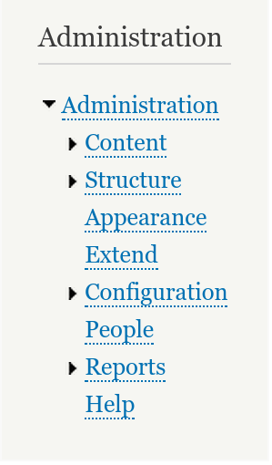

# The successor(s) of hook_menu

## Routing in Drupal 8
---

## Daniel Wehner


https://drupal.org/u/dawehner
<br />
Twitter: @da_wehner

---

# Background?
Note: module developer, other programming languages, symfony, frontend only (angular, backbone …)?

---

## Routing

Routing ensures that for a given url ("/node")

the appropriate content is returned.

---

## Blast from the past


***

### Drupal 7: hook_menu()

```
function user_menu() {
  $items['user'] = array(
    'page callback' => 'user_page',
    'access arguments' => array('access user'),
    'title' => 'User account',
    'title callback' => 'user_menu_title',
    'file' => 'user.pages.inc',
    'weight' => -10,
    'menu_name' => 'user-menu',
  );

  return $items;
}
```

***

## Blast from the past

### Drupal 7: Page callback

```

function user_page() {
  global $user;

  if ($user->uid) {
    // Redirect to another URL.
    return drupal_goto("$user/$user->uid");
  }

  else {
    // Render a form.
    return drupal_get_form('user_login');
  }

}

```

***

### Drupal 7: Summary

* Based upon paths
* 1:1 mapping of path to route
* Too many responsibilities: menu links / local tasks / breadcrumbs ...<br />
* No good support for web services

Note:

---

## Drupal 8


<span>

</span>
<span>


</span>
<span>

</span>

***

# Don't panic!

---

## HTTP based architecture


***

## Classes/PSR-4

* Namespaces match to files directly.
* modules/user/src/Example.php

```
namespace Drupal\user\Example;

class Example {
}
```

***

## $module.routing.yml

<strike>hook_menu, page callback</strike>
<!-- .element: class="fragment" data-fragment-index="1" -->

```
user.page:
  path: '/user'
  defaults:
    _content: '\Drupal\user\Controller\UserController::userPage'
  requirements:
    _permission: 'access user'
```
<!-- .element: class="fragment" data-fragment-index="1" -->

## controller <!-- .element: class="fragment" data-fragment-index="2" -->


```
namespace Drupal\user\Controller;

class UserController extends ControllerBase {

  public function userPage() {

    $user = $this->currentUser();

    if ($user->id()) {
      $response = $this->redirect('user.view', array('user' => $user->id()));
    }

    else {
      $response = $this->formBuilder()->getForm('Drupal\user\Form\UserLoginForm');
    }
    return $response;
  }
}
```
<!-- .element: class="fragment" data-fragment-index="2" -->

Note: talk about OOP a bit.

***

## Summary

* New routing system handles more than paths
* Based upon symfony components
* Decoupled from menu links
* More flexible

---

## Access checking

<strike>access callback, access arguments</strike>
<!-- .element: class="fragment" data-fragment-index="1" -->

```
user.admin_account:
  path: '/admin/people'
  defaults:
    _controller: '\Drupal\user\Controller\UserAdmin::userList'
  requirements:
    _permission: 'administer users'
```
<!-- .element: class="fragment" data-fragment-index="1" -->

***

## 403: Access denied


Note: Depending on the accept header you get back the appropriate content: json, xml, html ...

***

## Access checkers

* Based upon roles, permissions:
```
  _permission: "administer nodes"
  _role: "administrator"
```
* Based upon access to Entities (view, update, delete)
```
_entity_access: $entity_type.$operation
```

* Custom callback
```
  _custom_access: Drupal\shortcut\Form\SwitchShortcutSet::checkAccess
```
* Everyone!
```
_access: 'TRUE'
```

***

## Access mode

* Must match <span class="highlight-red">ALL</span> (default)
* <span class="highlight-red">ANY</span> must match


```
node.add_page:
  path: '/node/add'
  defaults:
    _content: '\Drupal\node\Controller\NodeController::addPage'
  requirements:
    _permission: 'administer content types'
    _node_add_access: 'node'
  options:
    _access_mode: 'ANY'
```

---

## Parameters

* <strike>page arguments</strike>
* Pass <span class="highlight-red">variables</span> from the URL to the controller
* <span class="highlight-red">Convert</span> IDs to entities

```
user.cancel_confirm:
  path: '/user/{user}/cancel/confirm/{timestamp}/{hashed_pass}'
  defaults:
    _title: 'Confirm account cancellation'
    _content: '\Drupal\user\Controller\UserController::confirmCancel'
    timestamp: 0
    hashed_pass: ''
  requirements:
    _entity_access: 'user.delete'
```
<!-- .element: class="fragment" data-fragment-index="1" -->

Note: parameters from the URL, defaults => optional in the URL,

***

## Title

<strike>title, title callback, drupal_set_title()</strike>

```
user.view:
  path: '/user/{user}'
  defaults:
    _entity_view: 'user.full'
    _title: User
    _title_callback: 'Drupal\user\Controller\UserController::userTitle'
```
<!-- .element: class="fragment" data-fragment-index="1" -->

```
  public function content() {
    $build['#markup'] = $this->t('Badcamp 2014');
    $build['#title'] = \Drupal::service('date')->format(REQUEST_TIME, 'short');
    return $build;
  }
```
<!-- .element: class="fragment" data-fragment-index="1" -->

---

# More general tricks

***

## Special controller types

<ul>
  <li><code class="highlight-red">_content</code>:  Content on a page</li>
  <li><code class="highlight-red">_form</code>: Forms</li>
  <li><code>_controller</code>:  Raw data, like json</li>
  <li><code>_entity_view: node.view</code>:  A rendered entity</li>
  <li><code>_entity_form: node.add</code>:  An entity edit/add form</li>
  <li><code>_entity_list: node</code>:  A list of entities</li>
</ul>

***


## ControllerBase

```
<?php
namespace Drupal\Core\Controller;

class ControllerBase {
  protected function entityManager() { }
  protected function cache($bin = 'cache') { }
  protected function config($name) { }
  protected function keyValue($collection) { }
  protected function moduleHandler() { }
  protected function url($route_name, $route_parameters = array(), $options = array()) { }
  protected function l($text, $route_name, array $parameters = array(), array $options = array()) { }
  protected function currentUser() { }
  protected function t($string, array $args = array(), array $options = array()) { }
  protected function redirect($route_name, array $route_parameters = array(), $status = 302) { }
}
```

```
class NodeController extends ControllerBase {
  protected function buildPage(NodeInterface $node) {
  return ['nodes' => $this->entityManager()->getViewBuilder('node')->view($node)];
  }
}
```

***

## Link to an URL

```
$route_parameters = ['user' => 1];
\Drupal::url('route_name', $route_parameters);

$url = Url::fromRoute('route_name', $route_parameters);
$url = Url::fromUri('http://example.com');

$url->access

\Drupal::l('text', $url);
$url->toString();
```

***

## Forms


***
## Forms
<strike>drupal_get_form(), form callback</strike>

<li>Forms are classes</li>
<li>Uses <code>_form</code> instead of <code>_content</code></li>
<li>No method needed</li>

```
user.login:
  path: '/user/login'
  defaults:
    _form: '\Drupal\user\Form\UserLoginForm'
    _title: 'Log in'
  requirements:
    _access: 'TRUE'
```

***

## Example form

```
class UserLoginForm extends FormBase {
  public function getFormId() { return 'user_login_form'; }

  public function buildForm(array $form, FormstateInterface $form_state) {
    $form['name'] = array(
      '#type' => 'textfield',
      '#title' => $this->t('Username'),
    );
    $form['pass'] = array(
      '#type' => 'password',
      '#title' => $this->t('Password'),
    );
    return $form;
  }

  public function submitForm(array &$form, FormStateInterface $form_state) {
    $account = $this->userStorage->load($form_state['uid']);
    $form_state->setRedirect(
      'user.view',
      ['user' => $account->id()],
    );

    user_login_finalize($account);
  }
}
```

***

## Helper forms

* ```\Drupal\Core\Form\FormBase```
* ```\Drupal\Core\Form\ConfigFormBase```
* ```\Drupal\Core\Form\ConfirmFormBase```
* ```\Drupal\Core\Entity\EntityFormController```

***

## Raw results

```
example.route:
  path: /raw-content
  defaults:
    _controller: Drupal\example\ExampleJson::data
```

```
class ExampleJson extends ControllerBase {

  public function data() {
    return JsonResponse([3, 1, 4, 1, 5, 9, 2, 6]);
  }

}
```

***

## Summary

* Register routes via <span class="highlight-red">$module.routing.yml</span>
* Set a callback via <code class="highlight-red">_content</code>: class::method
* Set a title via <code class="highlight-red">_title</code>
* Set access in <code>requirements</code>
* Use ControllerBase methods


---

## Menu links


***

## Menu links



***

## Menu links

<strike>'type' => MENU_NORMAL_ITEM</strike>
## $module.links.menu.yml

```
user.page:
  title: 'My account'
  weight: -10
  route_name: user.page
  menu_name: account
user.admin_account:
  title: People
  route_name: user.admin_account
  description: 'Manage user accounts, roles, and permissions.'
  parent: system.admin
  weight: 4
```

***

## Local tasks / tabs


***

## $module.links.task.yml

<strike>'type' => MENU_LOCAL_TASK</strike>

```
user.page:
  route_name: user.page
  tab_root_id: user.page
  title: 'Log in'
  weight: -10
user.register:
  route_name: user.register
  tab_root_id: user.page
  title: 'Create new account'
user.pass:
  route_name: user.pass
  tab_root_id: user.page
  title: 'Request new password'
```

***

## Local actions


***

## $module.links.action.yml
<strike>'type' => MENU_LOCAL_ACTION</strike>

```
node.type_add:
  route_name: node.type_add
  title: 'Add content type'
  appears_on:
    - node.overview_types
```

***

## Contextual links


## $module.links.contextual.yml
<!-- .element: class="fragment" data-fragment-index="1" -->

```
block_configure:
  title: 'Configure block'
  route_name: 'block.admin_edit'
  group: 'block'
```
<!-- .element: class="fragment" data-fragment-index="1" -->

***

## Breadcrumbs


***

## Path based breadcrumbs

* No need to specify anything
* Path based
  * /node/add/<span class="highlight-red">article</span><br>
  * /node/<span class="highlight-red">add</span><br>
  * /<span class="highlight-red">node</span><br>
  * <span class="highlight-red">/</span>
* Home » Add content

---

## Thank you!
##

## Come to the sprints
## to learn more!

---


## Dynamic routes

### $module.routing.yml
```
route_callbacks:
  - '\Drupal\search\Routing\SearchPageRoutes::routes'
```

***

#### \Drupal\search\Routing\SearchPageRoutes::routes

```
class SearchPageRoutes implements ContainerInjectionInterface {
  public function routes() {
    if ($default_page = $this->searchPageRepository->getDefaultSearchPage()) {
      $routes['search.view'] = new Route(
        '/search',
        array(
          '_content' => 'Drupal\search\Controller\SearchController::redirectSearchPage',
        ),
        array(
          '_entity_access' => 'entity.view',
          '_permission' => 'search content',
        ),
      );
    }
  }
}
```

***

## Custom access checkers


#### $module.services.yml
```
services:
  access_check.permission:
    class: Drupal\user\Access\PermissionAccessCheck
    tags:
      - { name: access_check, applies_to: _permission }
```

#### Drupal\user\Access\PermissionAccessCheck
```
class PermissionAccessCheck implements StaticAccessCheckInterface {

  public function access(Route $route, Request $request, AccountInterface $account) {
    $permission = $route->getRequirement('_permission');
    return $account->hasPermission($permission) ? static::ALLOW : static::DENY;
  }

}
```

https://www.previousnext.com.au/blog/controlling-access-drupal-8-routes-access-checks

***

## Custom paramconverter

```
paramconverter.badcamp:
  class: Drupal\badcamp\ParamConverter
  tags:
    - { name: paramconverter, priority: 10 }
```

```
class ParamConverter implements ParamConverterInterface {
  public function applies($definition, $name, Route $route) {
    // Return
    return $name == 'badcamp.example';
  }
  public function convert($value, $definition, $name, array $defaults, Request $request) {
    // Convert the value.
  }
}
```

https://www.drupal.org/node/2310427

***

## Custom breadcrumb

```
services:
  taxonomy_term.breadcrumb:
  class: Drupal\taxonomy\TermBreadcrumbBuilder
  tags:
   - { name: breadcrumb_builder, priority: 1002 }
```

```
namespace Drupal\taxonomy;
class TermBreadcrumbBuilder extends BreadcrumbBuilderBase {

  public function applies(RouteMatchInterface $route_match) {
    return $route_match->getRouteName() == 'entity.taxonomy_term.canonical'
      && $route_match->getParameter('taxonomy_term') instanceof TermInterface;
  }

  public function build(RouteMatchInterface $route_match) {
    $term = $route_match->getParameter('taxonomy_term');
    $breadcrumb = array();
    while ($parents = taxonomy_term_load_parents($term->id())) {
      $term = array_shift($parents);
      $breadcrumb[] = Link::createFromRoute($term->getName(),
        'entity.taxonomy_term.canonical', array('taxonomy_term' => $term->id()));
    }
    $breadcrumb[] = Link::createFromRoute($this->t('Home'), '<front>');
    $breadcrumb = array_reverse($breadcrumb);

    return $breadcrumb;
  }
}
```

***

## Theme negotiators

* Determine the used theme on a request<br><br>
* <code>theme.negotiator.default</code>
* <code>theme.negotiator.user</code>
* <code>theme.negotiator.admin_theme</code>

***

## Custom negotiator

```
theme.negotiator.admin_theme:
  class: Drupal\user\Theme\AdminNegotiator
  arguments: ['@current_user', '@config.factory', '@entity.manager']
  tags:
    - { name: theme_negotiator, priority: -40 }
```

```
class AdminNegotiator implements ThemeNegotiatorInterface {

  public function determineActiveTheme(Request $request) {
    $path = $request->attributes->get('_system_path');

    if ($this->user->hasPermission('view the administration theme') && path_is_admin($path)) {
      return $this->configFactory->get('system.theme')->get('admin');
    }
  }

}
```
